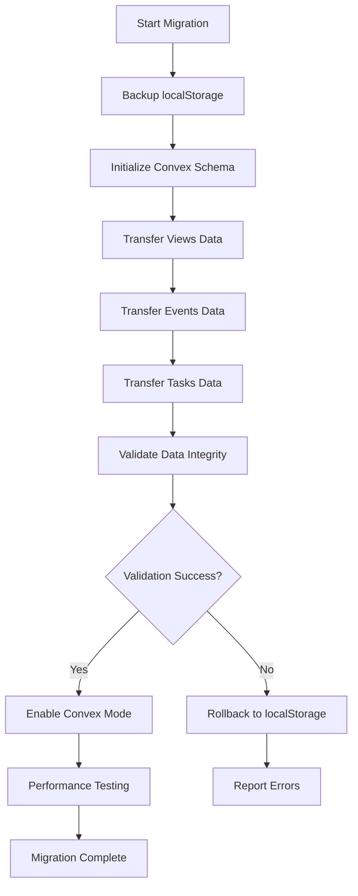
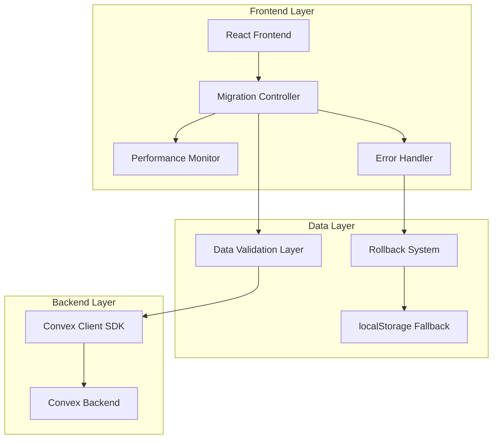

# Convex Backend Migration Plan

## 1. Product Overview

This document outlines a comprehensive migration strategy to transition the Chrono calendar application from local storage to Convex backend while maintaining native-like performance and preserving all existing functionality as a direct 1:1 replica.

The migration will ensure zero feature loss, maintain the responsive feel of local storage, and provide a seamless user experience during and after the transition.

## 2. Core Features

### 2.1 Current Local Storage Analysis

Based on the codebase analysis, the application currently stores:

| Data Type | Storage Key | Structure | Features |
|-----------|-------------|-----------|----------|
| Calendar Events | `calendarEvents` | Array of event objects | CRUD operations, recurring events, view filtering |
| Tasks | `tasks` | Object with collections (all, today, tag groups) | Task management, recurring tasks, scheduling |
| Views | `chrono_views` | Array of view objects | Custom views, default personal view |
| Active Views | `chrono_active_view_ids` | Array of active view IDs | View state management |

### 2.2 Feature Module

Our migration requirements consist of the following main components:
1. **Data Migration System**: Seamless transition from localStorage to Convex
2. **Performance Optimization Layer**: Caching and synchronization strategies
3. **Error Handling & Rollback**: Robust error recovery mechanisms
4. **Testing Framework**: Comprehensive feature parity validation
5. **Monitoring Dashboard**: Performance benchmarking tools

### 2.3 Page Details

| Component | Module Name | Feature Description |
|-----------|-------------|--------------------|
| Data Migration | Migration Controller | Detect existing data, backup, transfer to Convex, validate integrity |
| Performance Layer | Optimistic Updates | Implement optimistic UI updates, background sync, conflict resolution |
| Error Handling | Rollback System | Automatic fallback to localStorage, error logging, user notifications |
| Testing Suite | Feature Parity Tests | Automated tests for all CRUD operations, performance benchmarks |
| Monitoring | Performance Dashboard | Real-time metrics, latency tracking, success rate monitoring |

## 3. Core Process

### 3.1 Migration Flow

**Phase 1: Preparation**
- Backup existing localStorage data
- Initialize Convex schema
- Set up migration flags

**Phase 2: Data Transfer**
- Migrate views and active view settings
- Transfer calendar events with recurrence patterns
- Migrate tasks with all collections
- Validate data integrity

**Phase 3: Performance Optimization**
- Implement optimistic updates
- Set up background synchronization
- Configure caching strategies

**Phase 4: Testing & Validation**
- Run feature parity tests
- Performance benchmarking
- User acceptance testing



## 4. User Interface Design

### 4.1 Design Style

- **Migration Indicator**: Subtle progress bar during migration
- **Performance Metrics**: Optional developer dashboard
- **Error States**: Non-intrusive error notifications
- **Fallback UI**: Seamless fallback indicators
- **Success Confirmation**: Minimal success notification

### 4.2 Page Design Overview

| Component | Module Name | UI Elements |
|-----------|-------------|-------------|
| Migration Progress | Progress Indicator | Linear progress bar, percentage complete, current step description |
| Error Notifications | Error Toast | Red accent color, clear error message, retry button |
| Performance Dashboard | Metrics Panel | Real-time latency graphs, success rate indicators, sync status |
| Fallback Mode | Status Indicator | Yellow warning icon, "Offline Mode" label, sync pending count |

### 4.3 Responsiveness

The migration system is designed to be invisible to users, maintaining the existing responsive design patterns. All UI elements are mobile-adaptive and touch-optimized.

## 5. Technical Architecture

### 5.1 Architecture Design



### 5.2 Technology Stack

- **Frontend**: React@18 + Next.js@15.3.0 + Convex Client SDK
- **Backend**: Convex (serverless functions + real-time database)
- **Migration Tools**: Custom migration controller with validation
- **Performance**: Optimistic updates + background sync
- **Fallback**: localStorage with sync queue

### 5.3 API Endpoints

| Endpoint | Purpose | Local Storage Equivalent |
|----------|---------|-------------------------|
| `api.events.list()` | Get all events | `localStorage.getItem('calendarEvents')` |
| `api.events.create()` | Create event | Event addition to localStorage |
| `api.events.update()` | Update event | Event modification in localStorage |
| `api.events.delete()` | Delete event | Event removal from localStorage |
| `api.tasks.list()` | Get all tasks | `localStorage.getItem('tasks')` |
| `api.tasks.create()` | Create task | Task addition to localStorage |
| `api.tasks.update()` | Update task | Task modification in localStorage |
| `api.tasks.delete()` | Delete task | Task removal from localStorage |
| `api.views.list()` | Get views | `localStorage.getItem('chrono_views')` |
| `api.views.create()` | Create view | View addition to localStorage |
| `api.views.update()` | Update view | View modification in localStorage |
| `api.views.delete()` | Delete view | View removal from localStorage |

## 6. Data Model

### 6.1 Convex Schema Definition

```javascript
// convex/schema.js
import { defineSchema, defineTable } from "convex/server";
import { v } from "convex/values";

export default defineSchema({
  events: defineTable({
    title: v.string(),
    start: v.string(), // ISO date string
    end: v.string(),   // ISO date string
    allDay: v.boolean(),
    isAllDay: v.boolean(),
    viewId: v.string(),
    repeat: v.optional(v.string()),
    seriesId: v.optional(v.string()),
    isRepeat: v.optional(v.boolean()),
    rruleOptions: v.optional(v.object({
      freq: v.number(),
      interval: v.optional(v.number()),
      dtstart: v.string(),
      until: v.optional(v.string()),
      count: v.optional(v.number()),
      byweekday: v.optional(v.array(v.number())),
      bymonthday: v.optional(v.array(v.number())),
      bymonth: v.optional(v.array(v.number()))
    })),
    isDraft: v.optional(v.boolean()),
    userId: v.string()
  }),
  
  tasks: defineTable({
    title: v.string(),
    completed: v.boolean(),
    scheduledDate: v.optional(v.string()),
    createdAt: v.string(),
    tag: v.optional(v.object({
      id: v.string(),
      name: v.string(),
      color: v.string()
    })),
    repeat: v.optional(v.string()),
    seriesId: v.optional(v.string()),
    isRepeat: v.optional(v.boolean()),
    startDateOfSeries: v.optional(v.string()),
    originalBaseId: v.optional(v.string()),
    rruleOptions: v.optional(v.object({
      freq: v.number(),
      interval: v.optional(v.number()),
      dtstart: v.string(),
      until: v.optional(v.string()),
      count: v.optional(v.number()),
      byweekday: v.optional(v.array(v.number())),
      bymonthday: v.optional(v.array(v.number())),
      bymonth: v.optional(v.array(v.number()))
    })),
    userId: v.string()
  }),
  
  views: defineTable({
    name: v.string(),
    userId: v.string()
  }),
  
  userSettings: defineTable({
    activeViewIds: v.array(v.string()),
    userId: v.string()
  })
});
```

## 7. Migration Implementation Strategy

### 7.1 Phase 1: Data Backup and Validation

```javascript
// Migration Controller - Phase 1
class MigrationController {
  async backupLocalStorage() {
    const backup = {
      events: localStorage.getItem('calendarEvents'),
      tasks: localStorage.getItem('tasks'),
      views: localStorage.getItem('chrono_views'),
      activeViews: localStorage.getItem('chrono_active_view_ids'),
      timestamp: new Date().toISOString()
    };
    
    // Store backup in IndexedDB for recovery
    await this.storeBackup(backup);
    return backup;
  }
  
  validateLocalData(backup) {
    const validation = {
      events: this.validateEvents(backup.events),
      tasks: this.validateTasks(backup.tasks),
      views: this.validateViews(backup.views),
      activeViews: this.validateActiveViews(backup.activeViews)
    };
    
    return validation;
  }
}
```

### 7.2 Phase 2: Data Transfer with Integrity Checks

```javascript
// Migration Controller - Phase 2
class DataTransfer {
  async migrateToConvex(validatedData, userId) {
    const results = {
      events: await this.migrateEvents(validatedData.events, userId),
      tasks: await this.migrateTasks(validatedData.tasks, userId),
      views: await this.migrateViews(validatedData.views, userId),
      settings: await this.migrateSettings(validatedData.activeViews, userId)
    };
    
    // Verify data integrity
    const verification = await this.verifyMigration(validatedData, results);
    
    if (!verification.success) {
      throw new Error(`Migration verification failed: ${verification.errors}`);
    }
    
    return results;
  }
  
  async verifyMigration(original, migrated) {
    // Compare counts, key fields, and data integrity
    const checks = {
      eventCount: original.events.length === migrated.events.length,
      taskCount: original.tasks.all?.length === migrated.tasks.length,
      viewCount: original.views.length === migrated.views.length
    };
    
    return {
      success: Object.values(checks).every(Boolean),
      checks,
      errors: Object.entries(checks)
        .filter(([_, passed]) => !passed)
        .map(([check]) => `${check} failed`)
    };
  }
}
```

### 7.3 Phase 3: Performance Optimization

```javascript
// Optimistic Update System
class OptimisticUpdateManager {
  constructor(convexClient) {
    this.convex = convexClient;
    this.pendingUpdates = new Map();
    this.syncQueue = [];
  }
  
  async optimisticUpdate(operation, data) {
    // Apply update immediately to UI
    const tempId = this.generateTempId();
    this.applyLocalUpdate(operation, { ...data, _tempId: tempId });
    
    // Queue for background sync
    this.syncQueue.push({ operation, data, tempId });
    
    // Process sync queue
    this.processSyncQueue();
    
    return tempId;
  }
  
  async processSyncQueue() {
    if (this.syncQueue.length === 0) return;
    
    const batch = this.syncQueue.splice(0, 10); // Process in batches
    
    for (const item of batch) {
      try {
        const result = await this.convex.mutation(item.operation, item.data);
        this.resolveOptimisticUpdate(item.tempId, result);
      } catch (error) {
        this.revertOptimisticUpdate(item.tempId, error);
      }
    }
  }
}
```

## 8. Performance Benchmarking Strategy

### 8.1 Metrics to Track

| Metric | Target | Measurement Method |
|--------|--------|-----------------|
| Initial Load Time | < 100ms | Time to first render |
| CRUD Operation Latency | < 50ms perceived | Optimistic updates |
| Sync Completion Time | < 500ms | Background sync |
| Offline Capability | 100% functional | localStorage fallback |
| Data Consistency | 99.9% | Conflict resolution success |

### 8.2 Benchmarking Implementation

```javascript
// Performance Monitor
class PerformanceBenchmark {
  constructor() {
    this.metrics = {
      loadTimes: [],
      operationLatencies: [],
      syncTimes: [],
      errorRates: []
    };
  }
  
  measureOperation(operationType, operation) {
    const startTime = performance.now();
    
    return operation().then(result => {
      const endTime = performance.now();
      const duration = endTime - startTime;
      
      this.recordMetric(operationType, duration);
      
      return result;
    }).catch(error => {
      this.recordError(operationType, error);
      throw error;
    });
  }
  
  generateReport() {
    return {
      averageLoadTime: this.calculateAverage(this.metrics.loadTimes),
      averageOperationLatency: this.calculateAverage(this.metrics.operationLatencies),
      averageSyncTime: this.calculateAverage(this.metrics.syncTimes),
      errorRate: this.calculateErrorRate(),
      recommendations: this.generateRecommendations()
    };
  }
}
```

## 9. Error Handling and Rollback Procedures

### 9.1 Error Categories and Responses

| Error Type | Response Strategy | Rollback Trigger |
|------------|------------------|------------------|
| Network Failure | Queue operations, continue offline | None (graceful degradation) |
| Data Corruption | Restore from backup | Immediate |
| Migration Failure | Halt migration, restore localStorage | Immediate |
| Sync Conflicts | Merge strategies, user resolution | None (conflict resolution) |
| Performance Degradation | Optimize queries, cache tuning | If >2x slower than localStorage |

### 9.2 Rollback Implementation

```javascript
// Rollback System
class RollbackManager {
  async executeRollback(reason, backupData) {
    console.warn(`Executing rollback due to: ${reason}`);
    
    // 1. Disable Convex mode
    await this.disableConvexMode();
    
    // 2. Restore localStorage from backup
    await this.restoreLocalStorage(backupData);
    
    // 3. Clear any corrupted Convex data
    await this.cleanupConvexData();
    
    // 4. Notify user and log incident
    this.notifyUser(reason);
    this.logRollbackIncident(reason, backupData);
    
    return { success: true, restoredData: backupData };
  }
  
  async restoreLocalStorage(backup) {
    Object.entries(backup).forEach(([key, value]) => {
      if (key !== 'timestamp' && value) {
        localStorage.setItem(key, value);
      }
    });
    
    // Trigger storage events to update UI
    window.dispatchEvent(new StorageEvent('storage', {
      key: null, // Indicates multiple keys changed
      url: window.location.href
    }));
  }
}
```

## 10. Testing Methodology

### 10.1 Feature Parity Test Suite

```javascript
// Test Suite for Feature Parity
describe('Convex Migration Feature Parity', () => {
  describe('Calendar Events', () => {
    test('Create event matches localStorage behavior', async () => {
      const eventData = createTestEvent();
      
      // Test localStorage implementation
      const localResult = await createEventLocalStorage(eventData);
      
      // Test Convex implementation
      const convexResult = await createEventConvex(eventData);
      
      expect(normalizeEvent(convexResult)).toEqual(normalizeEvent(localResult));
    });
    
    test('Recurring events generate same instances', async () => {
      const recurringEvent = createRecurringTestEvent();
      
      const localInstances = generateLocalRecurringInstances(recurringEvent);
      const convexInstances = await generateConvexRecurringInstances(recurringEvent);
      
      expect(convexInstances.length).toBe(localInstances.length);
      expect(convexInstances.map(normalizeEvent)).toEqual(localInstances.map(normalizeEvent));
    });
  });
  
  describe('Performance Tests', () => {
    test('CRUD operations complete within performance targets', async () => {
      const operations = [
        () => createEvent(testEvent),
        () => updateEvent(testEvent.id, { title: 'Updated' }),
        () => deleteEvent(testEvent.id)
      ];
      
      for (const operation of operations) {
        const startTime = performance.now();
        await operation();
        const duration = performance.now() - startTime;
        
        expect(duration).toBeLessThan(50); // 50ms target
      }
    });
  });
});
```

### 10.2 Integration Test Strategy

1. **Data Migration Tests**: Verify complete data transfer without loss
2. **Performance Regression Tests**: Ensure no significant performance degradation
3. **Offline Functionality Tests**: Validate localStorage fallback behavior
4. **Conflict Resolution Tests**: Test sync conflict handling
5. **User Experience Tests**: Verify seamless transition for end users

## 11. Implementation Timeline

### 11.1 Development Phases

| Phase | Duration | Deliverables |
|-------|----------|-------------|
| **Phase 1: Foundation** | 1 week | Convex setup, schema design, basic CRUD operations |
| **Phase 2: Migration System** | 1 week | Data migration controller, backup/restore system |
| **Phase 3: Performance Layer** | 1 week | Optimistic updates, caching, background sync |
| **Phase 4: Error Handling** | 3 days | Rollback system, error recovery, monitoring |
| **Phase 5: Testing** | 1 week | Feature parity tests, performance benchmarks |
| **Phase 6: Deployment** | 2 days | Production deployment, monitoring setup |

### 11.2 Risk Mitigation

- **Data Loss Risk**: Comprehensive backup system with multiple restore points
- **Performance Risk**: Gradual rollout with performance monitoring
- **User Experience Risk**: Invisible migration with fallback mechanisms
- **Technical Risk**: Extensive testing and staged deployment

## 12. Success Criteria

### 12.1 Migration Success Metrics

- ✅ 100% data integrity preservation
- ✅ <50ms perceived latency for all operations
- ✅ Zero user-visible disruption during migration
- ✅ 99.9% uptime during transition period
- ✅ Complete feature parity with localStorage implementation

### 12.2 Post-Migration Benefits

- **Multi-device Synchronization**: Data available across all user devices
- **Real-time Collaboration**: Future capability for shared calendars
- **Enhanced Reliability**: Cloud backup and disaster recovery
- **Scalability**: Support for larger datasets and more complex features
- **Analytics**: Usage insights and performance optimization opportunities

This migration plan ensures a seamless transition from localStorage to Convex while maintaining the native feel and performance that users expect from the Chrono calendar application.