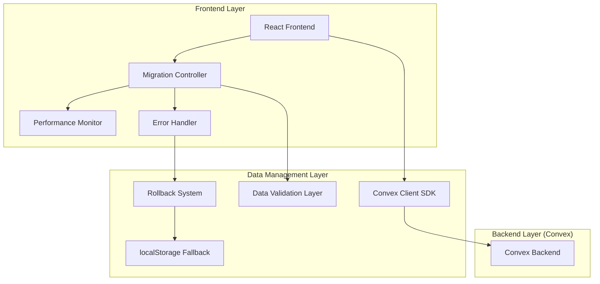
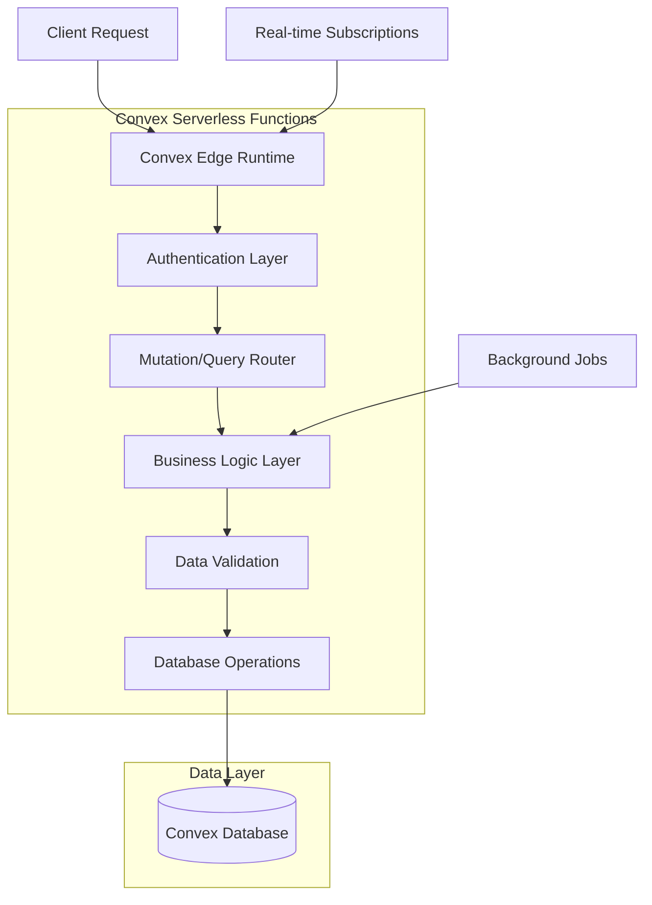
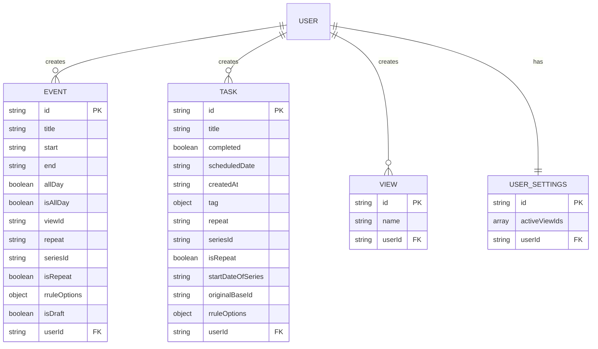

# Convex Technical Architecture Document

## 1. Architecture Design



## 2. Technology Description

- **Frontend**: React@18 + Next.js@15.3.0 + Convex Client SDK + Tailwind CSS
- **Backend**: Convex (serverless functions + real-time database)
- **Migration**: Custom migration controller with validation and rollback
- **Performance**: Optimistic updates + background sync + caching layer
- **Fallback**: localStorage with sync queue for offline support

## 3. Route Definitions

| Route | Purpose | Migration Impact |
|-------|---------|------------------|
| `/` | Main calendar view | Enhanced with real-time sync |
| `/settings` | User preferences | Migrated to Convex user settings |
| `/migration` | Migration status page | New route for migration monitoring |
| `/offline` | Offline mode indicator | Fallback mode when Convex unavailable |

## 4. API Definitions

### 4.1 Convex Mutations (Write Operations)

**Event Management**
```typescript
// Create Event
export const createEvent = mutation({
  args: {
    title: v.string(),
    start: v.string(),
    end: v.string(),
    allDay: v.boolean(),
    viewId: v.string(),
    repeat: v.optional(v.string()),
    rruleOptions: v.optional(v.object({
      freq: v.number(),
      interval: v.optional(v.number()),
      dtstart: v.string(),
      until: v.optional(v.string()),
      count: v.optional(v.number()),
      byweekday: v.optional(v.array(v.number())),
      bymonthday: v.optional(v.array(v.number())),
      bymonth: v.optional(v.array(v.number()))
    }))
  },
  handler: async (ctx, args) => {
    const userId = await getUserId(ctx);
    
    const eventId = await ctx.db.insert("events", {
      ...args,
      userId,
      isRepeat: false,
      isDraft: false
    });
    
    // Generate recurring instances if needed
    if (args.repeat && args.repeat !== 'none') {
      await generateRecurringInstances(ctx, eventId, args);
    }
    
    return eventId;
  }
});
```

**Task Management**
```typescript
// Create Task
export const createTask = mutation({
  args: {
    title: v.string(),
    completed: v.boolean(),
    scheduledDate: v.optional(v.string()),
    tag: v.optional(v.object({
      id: v.string(),
      name: v.string(),
      color: v.string()
    })),
    repeat: v.optional(v.string()),
    rruleOptions: v.optional(v.object({
      freq: v.number(),
      interval: v.optional(v.number()),
      dtstart: v.string(),
      until: v.optional(v.string()),
      count: v.optional(v.number()),
      byweekday: v.optional(v.array(v.number())),
      bymonthday: v.optional(v.array(v.number())),
      bymonth: v.optional(v.array(v.number()))
    }))
  },
  handler: async (ctx, args) => {
    const userId = await getUserId(ctx);
    
    const taskId = await ctx.db.insert("tasks", {
      ...args,
      userId,
      createdAt: new Date().toISOString(),
      isRepeat: false
    });
    
    // Generate recurring instances if needed
    if (args.repeat && args.repeat !== 'none') {
      await generateRecurringTaskInstances(ctx, taskId, args);
    }
    
    return taskId;
  }
});
```

**View Management**
```typescript
// Create View
export const createView = mutation({
  args: {
    name: v.string()
  },
  handler: async (ctx, args) => {
    const userId = await getUserId(ctx);
    
    return await ctx.db.insert("views", {
      name: args.name,
      userId
    });
  }
});
```

### 4.2 Convex Queries (Read Operations)

**Event Queries**
```typescript
// Get All Events
export const getEvents = query({
  args: {
    viewIds: v.optional(v.array(v.string()))
  },
  handler: async (ctx, args) => {
    const userId = await getUserId(ctx);
    
    let events = await ctx.db
      .query("events")
      .filter(q => q.eq(q.field("userId"), userId))
      .filter(q => q.eq(q.field("isDraft"), false))
      .collect();
    
    // Filter by viewIds if provided
    if (args.viewIds && args.viewIds.length > 0) {
      events = events.filter(event => args.viewIds.includes(event.viewId));
    }
    
    return events;
  }
});
```

**Task Queries**
```typescript
// Get Tasks by Collection
export const getTasks = query({
  args: {
    collection: v.optional(v.string()), // 'all', 'today', or tag ID
    date: v.optional(v.string()) // ISO date string for date-specific queries
  },
  handler: async (ctx, args) => {
    const userId = await getUserId(ctx);
    
    let tasks = await ctx.db
      .query("tasks")
      .filter(q => q.eq(q.field("userId"), userId))
      .collect();
    
    // Apply collection filtering
    if (args.collection === 'today') {
      const today = new Date().toISOString().split('T')[0];
      tasks = tasks.filter(task => 
        task.scheduledDate && 
        task.scheduledDate.startsWith(today)
      );
    } else if (args.collection && args.collection !== 'all') {
      // Filter by tag ID
      tasks = tasks.filter(task => 
        task.tag && task.tag.id === args.collection
      );
    }
    
    return tasks;
  }
});
```

### 4.3 Migration-Specific APIs

**Data Migration**
```typescript
// Migrate User Data
export const migrateUserData = mutation({
  args: {
    events: v.array(v.any()),
    tasks: v.any(), // Complex task structure from localStorage
    views: v.array(v.any()),
    activeViewIds: v.array(v.string())
  },
  handler: async (ctx, args) => {
    const userId = await getUserId(ctx);
    
    // Migrate events
    const eventIds = [];
    for (const event of args.events) {
      const eventId = await ctx.db.insert("events", {
        ...event,
        userId,
        start: event.start,
        end: event.end
      });
      eventIds.push(eventId);
    }
    
    // Migrate tasks
    const taskIds = [];
    if (args.tasks.all) {
      for (const task of args.tasks.all) {
        const taskId = await ctx.db.insert("tasks", {
          ...task,
          userId
        });
        taskIds.push(taskId);
      }
    }
    
    // Migrate views
    const viewIds = [];
    for (const view of args.views) {
      const viewId = await ctx.db.insert("views", {
        name: view.name,
        userId
      });
      viewIds.push(viewId);
    }
    
    // Migrate user settings
    await ctx.db.insert("userSettings", {
      activeViewIds: args.activeViewIds,
      userId
    });
    
    return {
      eventIds,
      taskIds,
      viewIds,
      success: true
    };
  }
});
```

## 5. Server Architecture Diagram



## 6. Data Model

### 6.1 Data Model Definition



### 6.2 Data Definition Language

**Convex Schema Definition**
```javascript
// convex/schema.js
import { defineSchema, defineTable } from "convex/server";
import { v } from "convex/values";

export default defineSchema({
  events: defineTable({
    title: v.string(),
    start: v.string(), // ISO date string
    end: v.string(),   // ISO date string
    allDay: v.boolean(),
    isAllDay: v.boolean(),
    viewId: v.string(),
    repeat: v.optional(v.string()),
    seriesId: v.optional(v.string()),
    isRepeat: v.optional(v.boolean()),
    rruleOptions: v.optional(v.object({
      freq: v.number(),
      interval: v.optional(v.number()),
      dtstart: v.string(),
      until: v.optional(v.string()),
      count: v.optional(v.number()),
      byweekday: v.optional(v.array(v.number())),
      bymonthday: v.optional(v.array(v.number())),
      bymonth: v.optional(v.array(v.number()))
    })),
    isDraft: v.optional(v.boolean()),
    userId: v.string()
  })
  .index("by_user", ["userId"])
  .index("by_user_and_view", ["userId", "viewId"])
  .index("by_series", ["seriesId"]),
  
  tasks: defineTable({
    title: v.string(),
    completed: v.boolean(),
    scheduledDate: v.optional(v.string()),
    createdAt: v.string(),
    tag: v.optional(v.object({
      id: v.string(),
      name: v.string(),
      color: v.string()
    })),
    repeat: v.optional(v.string()),
    seriesId: v.optional(v.string()),
    isRepeat: v.optional(v.boolean()),
    startDateOfSeries: v.optional(v.string()),
    originalBaseId: v.optional(v.string()),
    rruleOptions: v.optional(v.object({
      freq: v.number(),
      interval: v.optional(v.number()),
      dtstart: v.string(),
      until: v.optional(v.string()),
      count: v.optional(v.number()),
      byweekday: v.optional(v.array(v.number())),
      bymonthday: v.optional(v.array(v.number())),
      bymonth: v.optional(v.array(v.number()))
    })),
    userId: v.string()
  })
  .index("by_user", ["userId"])
  .index("by_user_and_date", ["userId", "scheduledDate"])
  .index("by_series", ["seriesId"])
  .index("by_tag", ["userId", "tag.id"]),
  
  views: defineTable({
    name: v.string(),
    userId: v.string()
  })
  .index("by_user", ["userId"]),
  
  userSettings: defineTable({
    activeViewIds: v.array(v.string()),
    userId: v.string()
  })
  .index("by_user", ["userId"])
});
```

**Database Indexes for Performance**
```javascript
// Performance-optimized indexes

// Events table indexes
.index("by_user", ["userId"]) // Fast user-specific queries
.index("by_user_and_view", ["userId", "viewId"]) // View filtering
.index("by_series", ["seriesId"]) // Recurring event management
.index("by_date_range", ["userId", "start"]) // Date-based queries

// Tasks table indexes
.index("by_user", ["userId"]) // Fast user-specific queries
.index("by_user_and_date", ["userId", "scheduledDate"]) // Today's tasks
.index("by_series", ["seriesId"]) // Recurring task management
.index("by_tag", ["userId", "tag.id"]) // Tag-based filtering
.index("by_completion", ["userId", "completed"]) // Completed/pending tasks

// Views table indexes
.index("by_user", ["userId"]) // User's views

// User settings indexes
.index("by_user", ["userId"]) // User settings lookup
```

**Initial Data Setup**
```javascript
// convex/migrations/001_initial_setup.js

// Create default view for new users
export const createDefaultView = mutation({
  args: { userId: v.string() },
  handler: async (ctx, args) => {
    const existingViews = await ctx.db
      .query("views")
      .filter(q => q.eq(q.field("userId"), args.userId))
      .collect();
    
    if (existingViews.length === 0) {
      const defaultViewId = await ctx.db.insert("views", {
        name: "Personal",
        userId: args.userId
      });
      
      // Create default user settings
      await ctx.db.insert("userSettings", {
        activeViewIds: [defaultViewId],
        userId: args.userId
      });
      
      return defaultViewId;
    }
    
    return existingViews[0]._id;
  }
});
```

## 7. Performance Optimization Strategies

### 7.1 Caching Layer

```javascript
// Client-side caching with React Query integration
import { useQuery, useMutation, useQueryClient } from '@tanstack/react-query';
import { useConvex } from 'convex/react';

const useOptimizedEvents = (viewIds) => {
  const convex = useConvex();
  
  return useQuery({
    queryKey: ['events', viewIds],
    queryFn: () => convex.query('events:getEvents', { viewIds }),
    staleTime: 30000, // 30 seconds
    cacheTime: 300000, // 5 minutes
    refetchOnWindowFocus: false
  });
};

const useOptimisticEventMutation = () => {
  const queryClient = useQueryClient();
  const convex = useConvex();
  
  return useMutation({
    mutationFn: (eventData) => convex.mutation('events:createEvent', eventData),
    onMutate: async (newEvent) => {
      // Cancel outgoing refetches
      await queryClient.cancelQueries(['events']);
      
      // Snapshot previous value
      const previousEvents = queryClient.getQueryData(['events']);
      
      // Optimistically update cache
      queryClient.setQueryData(['events'], old => {
        return [...(old || []), { ...newEvent, id: 'temp-' + Date.now() }];
      });
      
      return { previousEvents };
    },
    onError: (err, newEvent, context) => {
      // Rollback on error
      queryClient.setQueryData(['events'], context.previousEvents);
    },
    onSettled: () => {
      // Refetch after mutation
      queryClient.invalidateQueries(['events']);
    }
  });
};
```

### 7.2 Background Sync Implementation

```javascript
// Background sync service
class BackgroundSyncService {
  constructor(convex) {
    this.convex = convex;
    this.syncQueue = [];
    this.isOnline = navigator.onLine;
    this.setupEventListeners();
  }
  
  setupEventListeners() {
    window.addEventListener('online', () => {
      this.isOnline = true;
      this.processSyncQueue();
    });
    
    window.addEventListener('offline', () => {
      this.isOnline = false;
    });
  }
  
  async queueOperation(operation, data) {
    if (this.isOnline) {
      try {
        return await this.convex.mutation(operation, data);
      } catch (error) {
        // Queue for retry if network error
        if (this.isNetworkError(error)) {
          this.syncQueue.push({ operation, data, timestamp: Date.now() });
        }
        throw error;
      }
    } else {
      // Queue for later sync
      this.syncQueue.push({ operation, data, timestamp: Date.now() });
      return { queued: true, tempId: 'temp-' + Date.now() };
    }
  }
  
  async processSyncQueue() {
    if (!this.isOnline || this.syncQueue.length === 0) return;
    
    const batch = this.syncQueue.splice(0, 10); // Process in batches
    
    for (const item of batch) {
      try {
        await this.convex.mutation(item.operation, item.data);
      } catch (error) {
        // Re-queue failed operations
        this.syncQueue.unshift(item);
        break; // Stop processing on error
      }
    }
    
    // Continue processing if queue not empty
    if (this.syncQueue.length > 0) {
      setTimeout(() => this.processSyncQueue(), 5000); // Retry in 5 seconds
    }
  }
}
```

## 8. Security and Authentication

### 8.1 User Authentication

```javascript
// convex/auth.js
import { ConvexError } from "convex/values";

export async function getUserId(ctx) {
  const identity = await ctx.auth.getUserIdentity();
  if (!identity) {
    throw new ConvexError("Not authenticated");
  }
  return identity.subject;
}

export async function requireAuth(ctx) {
  const userId = await getUserId(ctx);
  return userId;
}
```

### 8.2 Data Access Control

```javascript
// Row-level security implementation
export const getEvents = query({
  args: { viewIds: v.optional(v.array(v.string())) },
  handler: async (ctx, args) => {
    const userId = await requireAuth(ctx);
    
    // Only return events owned by the authenticated user
    return await ctx.db
      .query("events")
      .filter(q => q.eq(q.field("userId"), userId))
      .collect();
  }
});
```

This technical architecture ensures a robust, performant, and secure migration from localStorage to Convex while maintaining the native feel and responsiveness of the original application.